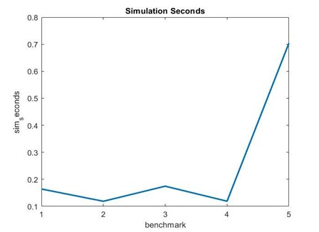
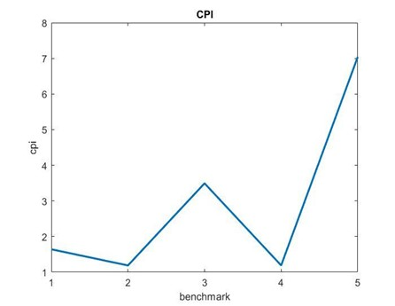
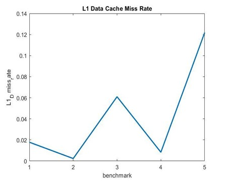
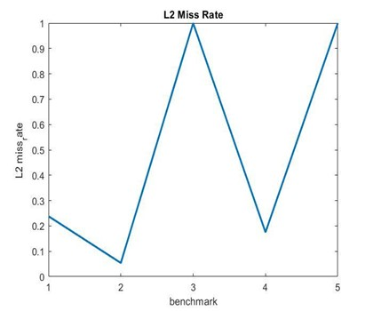

# auth-computer-arch-lab-ex2

**Lab 2**

*Tsirakis Orestis (9995)*

*Iliana Kogia (10090)*

1) MinorCPU Cache

[system]

cache\_line\_size=64

L1\_Instruction Cache: [system.cpu.icache]

assoc=2

size=32768=32kB

L1\_Data Cache: [system.cpu.dcache]

assoc=2

size=65536=64kB

L2 Cache: [system.l2]

assoc=8

size=2097152=2MB

2)

Integer benchmarks: bzip, mcf, sjeng, hmmer

Float benchmarks: libm

https://www.spec.org/cpu2006/Docs/

| Benchmarks | sim\_seconds | cpi | Dcache miss\_rate | Icache miss\_rate | L2 miss\_rate |
| --- | --- | --- | --- | --- | --- |
| 1.specbzip | 0.164249 | 1.642495 | 0.017821 | 0.000077 | 0.238176 |
| 2.spechmmer | 0.118876 | 1.188762 | 0.002353 | 0.000221 | 0.054059 |
| 3.speclibm | 0.174671 | 3.493415 | 0.060972 | 0.000094 | 0.999944 |
| 4.specmcf | 0.119056 | 1.190561 | 0.008329 | 0.000018 | 0.174927 |
| 5. specsjeng | 0.704128 | 7.041281 | 0.121835 | 0.000019 | 0.999917 |

 

 

 

 

Benchmark no.5 (specsjeng) takes the most time to complete with 0.7 seconds simulated and has the biggest L1 Data cache miss rate.

Benchmark no.2 (spechmmer) has the most L1 instruction cache misses.

Benchmark no.3 (speclibm) has the biggest L2 miss rate.

3)

| Frequency | system.clk\_domain.clock# Clock period in ticks | system.cpu\_clk\_domain.clock # Clock period in ticks |
| --- | --- | --- |
| Default | 1000 | 500 |
| 1GHz | 1000 | 1000 |
| 3GHz | 1000 | 333 |

We observe that the system clock is default and includes the memory controller and memory bus, the CPU clock follows the values we give as input flags and sets the cpu core and cache clock. If we add another cpu, it will take the value of cpu cluster clock.

1GHz:

| Benchmarks | sim\_seconds | cpi | Dcache miss\_rate | Icache miss\_rate | L2 miss\_rate |
| --- | --- | --- | --- | --- | --- |
| specbzip\_1GHz | 0.161025 | 1.610247 | 0.014675 | 0.000077 | 0.282157 |
| specmcf\_1GHz | 0.127942 | 1.279422 | 0.002108 | 0.023627 | 0.055046 |
| spechmmer\_1GHz | 0.118530 | 1.185304 | 0.001629 | 0.000221 | 0.077747 |
| specsjeng\_1GHz | 0.704056 | 7.040561 | 0.121831 | 0.000020 | 0.999972 |
| speclibm\_1GHz | 0.262327 | 2.623265 | 0.060971 | 0.000094 | 0.999944 |

3GHz)

| Benchmarks | sim\_seconds | cpi | Dcache miss\_rate | Icache miss\_rate | L2 miss\_rate |
| --- | --- | --- | --- | --- | --- |
| specbzip\_3GHz | 0.058385 | 1.753291 | 0.014932 | 0.000077 | 0.282166 |
| specmcf\_3GHz | 0.043867 | 1.317329 | 0.002108 | 0.023609 | 0.055046 |
| spechmmer\_3GHz | 0.039646 | 1.190581 | 0.001637 | 0.000221 | 0.077761 |
| specsjeng\_3GHz | 0.449821 | 13.508136 | 0.121831 | 0.000020 | 0.999972 |
| speclibm\_3GHz | 0.146433 | 4.397377 | 0.060972 | 0.000094 | 0.999944 |

4)

DDR3\_1600\_x64

| Benchmarks | sim\_seconds | cpi | Dcache miss\_rate | Icache miss\_rate | L2 miss\_rate |
| --- | --- | --- | --- | --- | --- |
| specbzip\_1\_4\_1600 | 0.083982 | 1.679650 | 0.014798 | 0.000077 | 0.282163 |
| spechmmer\_1\_4\_1600 | 0.059396 | 1.187917 | 0.001637 | 0.000221 | 0.077760 |
| speclibm\_1\_4\_1600 | 0.174671 | 3.493415 | 0.060972 | 0.000094 | 0.999944 |
| specmcf\_1\_4\_1600 | 0.064955 | 1.299095 | 0.002108 | 0.023612 | 0.055046 |
| specsjeng\_1\_4\_1600 | 0.513528 | 10.270554 | 0.121831 | 0.000020 | 0.999972 |

DDR3\_2133\_x64

| Benchmarks | sim\_seconds | cpi | Dcache miss\_rate | Icache miss\_rate | L2 miss\_rate |
| --- | --- | --- | --- | --- | --- |
| specbzip\_1\_4 | 0.083609 | 1.672175 | 0.014795 | 0.000077 | 0.282159 |
| spechmmer\_1\_4 | 0.059386 | 1.187722 | 0.001637 | 0.000221 | 0.077760 |
| speclibm\_1\_4 | 0.171530 | 3.430593 | 0.060972 | 0.000094 | 0.999944 |
| specmcf\_1\_4 | 0.064892 | 1.297844 | 0.002108 | 0.023612 | 0.055046 |
| specsjeng\_1\_4 | 0.493128 | 9.862562 | 0.121831 | 0.000020 | 0.999972 |

Less simulation seconds (faster memory access-\> better performance) , so we get a better cpi.

Section 2

1)

L1 = 16-256kB

We simulated the benchmarks with L1 being 32, 64, 80kB, because most of the times L1 size is close to 64kB to reduce the misses and have a higher hit rate with not much cost. We tried a bigger L1_I size than L1_D (65kB, 16kB) as the processor is usually sitting idle while an instruction is being fetched but we did not see any impact on the performance.

L2 = 256kB-4MB

We simulated the benchmarks with L2 being 256kB, 512kB, 2MB, although L2 size being 2MB may be too big for real systems.

Cache Line Size = 32, 64, 128

We simulated the benchmarks with Cache Line Size being 64B and 128B. 64B being the standard for modern systems, but we wanted to try a bigger line size to check if it improves the performance.

Associativity = 1, 2, 4

For L1 we checked associativity of 1(direct mapped) and 2 (2-way associative) as its size is smaller, for L2 we checked 2-way and 4-way associative.

2)

| Benchmarks | sim\_seconds | cpi | Dcache miss\_rate | Icache miss\_rate | L2 miss\_rate |
| --- | --- | --- | --- | --- | --- |
| specbzip\_1 | 0.168500 | 1.684997 | 0.017820 | 0.000077 | 0.326983 |
| specbzip\_2 | 0.171925 | 1.719245 | 0.021676 | 0.000072 | 0.266583 |
| specbzip\_3 | 0.171944 | 1.719439 | 0.021675 | 0.000084 | 0.266600 |
| specbzip\_4 | 0.173792 | 1.737925 | 0.017806 | 0.000077 | 0.424388 |
| specbzip\_5 | 0.164249 | 1.642495 | 0.017821 | 0.000077 | 0.238176 |
| specbzip\_6 | 0.177353 | 1.773530 | 0.021661 | 0.000072 | 0.348441 |
| specbzip\_7 | 0.172442 | 1.724417 | 0.021385 | 0.000090 | 0.271747 |
| specbzip\_8 | 0.168359 | 1.683594 | 0.017818 | 0.000077 | 0.319777 |
| specbzip\_9 | 0.172283 | 1.722835 | 0.021387 | 0.000090 | 0.265389 |
| specbzip\_10 | 0.168312 | 1.683117 | 0.017841 | 0.000067 | 0.239170 |

| Benchmarks | sim\_seconds | cpi | Dcache miss\_rate | Icache miss\_rate | L2 miss\_rate |
| --- | --- | --- | --- | --- | --- |
| spechmmer\_1 | 0.118877 | 1.188768 | 0.002353 | 0.000221 | 0.054355 |
| spechmmer\_2 | 0.119081 | 1.190813 | 0.002661 | 0.000087 | 0.048894 |
| spechmmer\_3 | 0.119172 | 1.191716 | 0.002661 | 0.000585 | 0.045956 |
| spechmmer\_4 | 0.118930 | 1.189300 | 0.002358 | 0.000222 | 0.064771 |
| spechmmer\_5 | 0.118876 | 1.188762 | 0.002353 | 0.000221 | 0.054059 |
| spechmmer\_6 | 0.119121 | 1.191210 | 0.002663 | 0.000087 | 0.054738 |
| spechmmer\_7 | 0.136136 | 1.361358 | 0.005676 | 0.034155 | 0.006823 |
| spechmmer\_8 | 0.118876 | 1.188762 | 0.002353 | 0.000221 | 0.054059 |
| spechmmer\_9 | 0.136132 | 1.361321 | 0.005676 | 0.034155 | 0.006728 |
| spechmmer\_10 | 0.118343 | 1.183426 | 0.001387 | 0.000347 | 0.048683 |

| Benchmarks | sim\_seconds | cpi | Dcache miss\_rate | Icache miss\_rate | L2 miss\_rate |
| --- | --- | --- | --- | --- | --- |
| speclibm\_1 | 0.262498 | 2.624978 | 0.060972 | 0.000094 | 0.999942 |
| speclibm\_2 | 0.263126 | 2.631263 | 0.060972 | 0.000088 | 0.999959 |
| speclibm\_3 | 0.262488 | 2.624883 | 0.060972 | 0.000113 | 0.999858 |
| speclibm\_4 | 0.262529 | 2.625290 | 0.060972 | 0.000094 | 0.999942 |
| speclibm\_5 | 0.262319 | 2.623187 | 0.060972 | 0.000094 | 0.999942 |
| speclibm\_6 | 0.262547 | 2.625472 | 0.060972 | 0.000088 | 0.999959 |
| speclibm\_7 | 0.265035 | 2.650347 | 0.062151 | 0.000122 | 0.973222 |
| speclibm\_8 | 0.262498 | 2.624978 | 0.060972 | 0.000094 | 0.999942 |
| speclibm\_9 | 0.265002 | 2.650021 | 0.062151 | 0.000122 | 0.973222 |
| speclibm\_10 | 0.199147 | 1.991471 | 0.030487 | 0.000112 | 0.999790 |

| Benchmarks | sim\_seconds | cpi | Dcache miss\_rate | Icache miss\_rate | L2 miss\_rate |
| --- | --- | --- | --- | --- | --- |
| specmcf\_1 | 0.128751 | 1.287506 | 0.002493 | 0.023626 | 0.063724 |
| specmcf\_2 | 0.119056 | 1.190561 | 0.008329 | 0.000018 | 0.174927 |
| specmcf\_3 | 0.143351 | 1.433507 | 0.008332 | 0.042807 | 0.031770 |
| specmcf\_4 | 0.129013 | 1.290132 | 0.002493 | 0.023626 | 0.067543 |
| specmcf\_5 | 0.128163 | 1.281627 | 0.002493 | 0.023626 | 0.054518 |
| specmcf\_6 | 0.119280 | 1.192799 | 0.008329 | 0.000018 | 0.184985 |
| specmcf\_7 | 0.134142 | 1.341420 | 0.006987 | 0.034838 | 0.039084 |
| specmcf\_8 | 0.128706 | 1.287057 | 0.002493 | 0.023626 | 0.063051 |
| specmcf\_9 | 0.134093 | 1.340926 | 0.006987 | 0.034838 | 0.038598 |
| specmcf\_10 | 0.132824 | 1.328239 | 0.001859 | 0.034828 | 0.027021 |

| Benchmarks | sim\_seconds | cpi | Dcache miss\_rate | Icache miss\_rate | L2 miss\_rate |
| --- | --- | --- | --- | --- | --- |
| specsjeng\_1 | 0.704126 | 7.041256 | 0.121833 | 0.000020 | 0.999950 |
| specsjeng\_2 | 0.704128 | 7.041281 | 0.121835 | 0.000019 | 0.999917 |
| specsjeng\_3 | 0.704128 | 7.041280 | 0.121835 | 0.000023 | 0.999899 |
| specsjeng\_4 | 0.704143 | 7.041429 | 0.121833 | 0.000020 | 0.999951 |
| specsjeng\_5 | 0.704009 | 7.040087 | 0.121833 | 0.000020 | 0.999948 |
| specsjeng\_6 | 0.704144 | 7.041437 | 0.121835 | 0.000019 | 0.999919 |
| specsjeng\_7 | 0.706132 | 7.061319 | 0.122441 | 0.000022 | 0.990072 |
| specsjeng\_8 | 0.704134 | 7.041344 | 0.121833 | 0.000020 | 0.999948 |
| specsjeng\_9 | 0.706138 | 7.061376 | 0.122441 | 0.000022 | 0.990071 |
| specsjeng\_10 | 0.497656 | 4.976564 | 0.060926 | 0.000015 | 0.999687 |

We create 10 different parameter sets where we change some values and let the others constant, so we can compare CPI.

Sets:

1, 2, 3: compare L1 different caches

1, 4, 5, 6: compare L2 different caches

7, 8, 9: compare the performance of different values of associativity while the other values are the same.

1, 10: compare the performance of different cache line sizes.

| Set Parameter | 1 | 2 | 3 | 4 | 5 | 6 | 7 | 8 | 9 | 10 |
| --- | --- | --- | --- | --- | --- | --- | --- | --- | --- | --- |
| L1\_d | 32kB | 16kB | 16kB | 32kB | 32kB | 16kB | 32kB | 32kB | 32kB | 32kB |
| L1\_i | 32kB | 64kB | 16kB | 32kB | 32kB | 64kB | 32kB | 32kB | 32kB | 32kB |
| L2 | 512kB | 512kB | 512kB | 256kB | 2MB | 256kB | 512kB | 512kB | 512kB | 512kB |
| L1\_i\_assoc | 2 | 2 | 2 | 2 | 2 | 2 | 1 | 2 | 1 | 2 |
| L1\_d\_assoc | 2 | 2 | 2 | 2 | 2 | 2 | 1 | 2 | 1 | 2 |
| L2\_assoc | 2 | 2 | 2 | 2 | 2 | 2 | 2 | 4 | 4 | 2 |
| Cache line | 64 | 64 | 64 | 64 | 64 | 64 | 64 | 64 | 64 | 128 |

**{1, 2, 3}**

    

We observe that for the L1 sizes of the set no.1 we get the optimum CPI for all benchmarks except specmcf (for mcf the best is set no.2).

L1_D=32kB, L1_I=32kB

**{1, 4, 5, 6}**

    

We observe that for the L2 sizes of the set no.5 we get the optimum CPI for all benchmarks except specmcf.

L2=2MB.

**{7, 8, 9}**

    

We observe that for the L1_Ass and L2_Ass of the set no.8 we get the optimum CPI for all benchmarks.

L1_D_Ass=2

L1_I_Ass=2

L2_Ass=4

**{1, 10}**

    

We observe that for the Cache line sizes of the set no.10 we get the optimum CPI for all benchmarks except specmcf.

Cache_Line_Size = 128

For benchmark MCF we mostly get the best performance for different values but we chose the optimal values for all the benchmarks.

Max Performance:

L1\_Data = 32kB

L1\_Instruction = 32kB

L2 = 2MB

L1\_D\_Ass = 2

L1\_I\_Ass = 2

L2\_Ass = 4

Cache\_line\_size = 128

| Benchmarks | sim\_seconds | cpi | Dcache miss\_rate | Icache miss\_rate | L2 miss\_rate |
| --- | --- | --- | --- | --- | --- |
| specbzip\_best | 0.163596 | 1.635955 | 0.017843 | 0.000067 | 0.138201 |
| spechmmer\_best | 0.118341 | 1.183408 | 0.001387 | 0.000347 | 0.048161 |
| speclibm\_best | 0.199046 | 1.990458 | 0.030487 | 0.000112 | 0.999790 |
| specmcf\_best | 0.132229 | 1.322294 | 0.001858 | 0.034834 | 0.020409 |
| specsjeng\_best | 0.497481 | 4.974806 | 0.060926 | 0.000015 | 0.999685 |

We get the best performance from all the other simulations for each benchmark.

Section 3

c1 = cost unit.

**Cost = c1\* L1\_size + (c1/10^2)\* L2\_size + 2\* c1 \* L1\_ass/16 + c1 \* L2\_ass/16**

The cost of L1 must be larger than the cost of L2.

As the size of the memory chip increases the cost increases too.

Increasing the associativity has a large effect on the complexity of the memory unit, so the cost rises.

a)L1 = 64kB, L2 = 512kB, Ass = 2,2,4

b)L1 = 64kB, L2 = 2MB, Ass = 2,2,4

1. Cost a = 64\*c1 + 5,12\*c1 + 0.25\*c1 + 0.25\*c1 = 69.62\*c1
2. Cost b = 64\*c1 + 20\*c1 + 0.5\*c1 = 84\*c1

The small difference in efficiency of L2 = 2MB is not worth such a bigger cost we will have to pay to implement our system. So we think it will be best to consider an L2 = 512kB to allow both efficiency and price availability.
